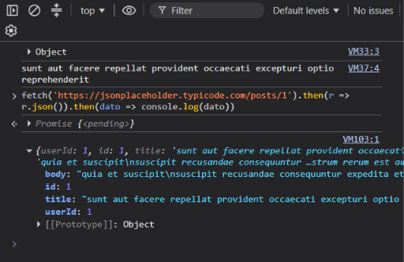
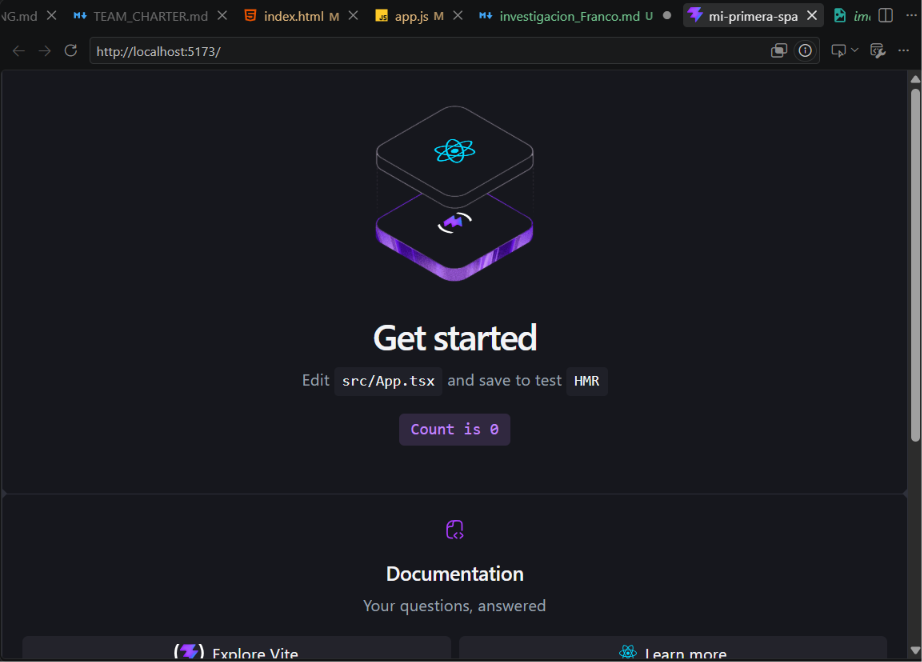
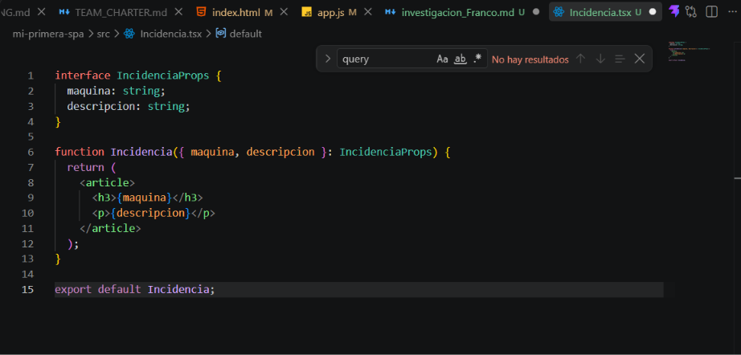
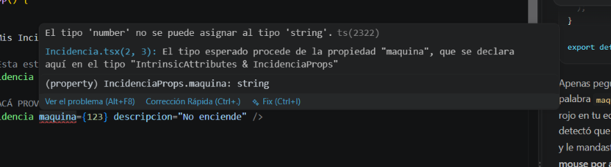
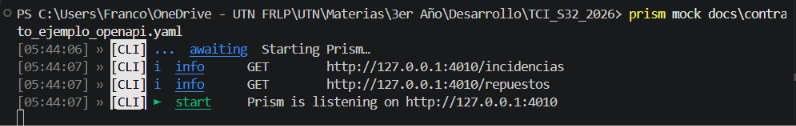
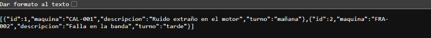

# Investigación — Lafitte, Franco (31971)

## Parte A — JS asincrónico + fetch + SPA

### Búsquedas
1. **¿Qué es una SPA (Single Page Application) y en qué se diferencia de una página tradicional (MPA)?**
   - *Búsqueda:* "diferencia entre SPA y MPA web"
   - *Fuente:* MDN Web Docs / blogs de desarrollo.
   - *Entendí que:* Una SPA carga una sola página HTML inicial y actualiza el contenido dinámicamente mediante JavaScript, sin recargar el navegador entero, haciendo que se sienta como una app nativa. Una MPA recarga toda la página por cada clic.
2. **¿Qué es una promesa (Promise) en JavaScript y para qué sirve? ¿Qué problema resuelve?**
   - *Búsqueda:* "qué es una promesa javascript"
   - *Fuente:* javascript.info
   - *Entendí que:* Es un objeto que representa el resultado eventual (éxito o fracaso) de una operación asincrónica. Resuelve el problema de quedarse bloqueado esperando una respuesta y evita el "callback hell" (anidamiento infinito de funciones).
3. **¿Por qué fetch devuelve una promesa y no el dato directamente?**
   - *Búsqueda:* "por que fetch devuelve una promesa"
   - *Fuente:* MDN Fetch API
   - *Entendí que:* Porque la petición a un servidor toma un tiempo impredecible (por la latencia de red). Si devolviera el dato directamente, el navegador se congelaría hasta que llegue la respuesta.
4. **¿Qué diferencia hay entre XMLHttpRequest (lo viejo) y fetch (lo actual)?**
   - *Búsqueda:* "diferencia entre XMLHttpRequest y fetch"
   - *Fuente:* varios blogs y MDN.
   - *Entendí que:* XMLHttpRequest está basado en callbacks y tiene una sintaxis más verbosa y compleja. Fetch es la API moderna, basada en promesas, lo que hace el código más limpio y fácil de encadenar o usar con async/await.

### Preguntas guía
1. **¿Qué significa que fetch sea asincrónico? ¿Qué pasaría con la página si no lo fuera?**
   Significa que la petición se ejecuta en segundo plano sin interrumpir el hilo principal de ejecución. Si fuera sincrónico, la página entera (interfaz, scroll, botones) se "congelaría" totalmente hasta que el servidor responda.
2. **¿Por qué `respuesta.json()` también devuelve una promesa?**
   Porque leer el cuerpo de la respuesta (que puede ser un archivo muy pesado o venir en fragmentos de red) también toma tiempo. La promesa se resuelve cuando todo el JSON fue recibido y parseado completamente.
3. **¿Qué relación hay entre una SPA y fetch? ¿Por qué la SPA "necesita" pedir datos así?**
   Como la SPA no recarga la página nunca, su única forma de obtener información nueva del servidor o enviar datos es haciéndolo "por detrás" usando peticiones asincrónicas con `fetch`. Sin `fetch` (o similares), la SPA no podría comunicarse con el backend.

### Evidencia de la actividad guiada
]()

---

## Parte B — React + TypeScript + Vite

### Búsquedas
1. **¿Qué es un componente en React? ¿Por qué conviene dividir la UI en componentes?**
   - *Búsqueda:* "qué es un componente en react"
   - *Fuente:* react.dev
   - *Entendí que:* Es una pieza de código independiente y reutilizable que representa una parte de la interfaz. Conviene porque permite mantener el código ordenado, facilita la reutilización y el trabajo en equipo paralelo.
2. **¿Qué es JSX? ¿Por qué se parece a HTML pero no es HTML?**
   - *Búsqueda:* "qué es jsx"
   - *Fuente:* react.dev
   - *Entendí que:* Es una extensión de sintaxis de JavaScript que permite escribir etiquetas similares a HTML dentro del código JS. Al final, React compila todo ese JSX a llamadas de JavaScript puro (`React.createElement`).
3. **¿Qué es el estado (useState)? ¿En qué se diferencia de una variable común?**
   - *Búsqueda:* "estado vs variable react"
   - *Fuente:* react.dev
   - *Entendí que:* El estado es la memoria del componente. A diferencia de una variable normal, cuando el estado cambia usando su función "setter", React re-renderiza (actualiza) automáticamente la pantalla para mostrar el nuevo valor.
4. **¿Qué son las props? ¿En qué se diferencian del estado?**
   - *Búsqueda:* "diferencia props y estado react"
   - *Fuente:* react.dev
   - *Entendí que:* Las props son los datos que un componente padre le pasa a un componente hijo (como los argumentos de una función). Son de solo lectura para el hijo, mientras que el estado es privado e interno del componente que lo declara.
5. **¿Por qué usar TypeScript en el frontend? ¿Qué problema te resuelve antes de que el código corra?**
   - *Búsqueda:* "por que usar typescript en frontend"
   - *Fuente:* typescriptlang.org
   - *Entendí que:* Agrega tipado estático a JavaScript. Atrapa errores de tipos (como pasar un string cuando se espera un número, o intentar acceder a una propiedad que no existe en un objeto) directamente en el editor, durante el desarrollo, antes de que el código llegue al navegador y rompa la app.

### Preguntas guía
1. **¿Qué relación ves entre el patrón "separar datos de la vista" que usaste en el taller de incidencia y el estado de React?**
   En el taller hacíamos un objeto `incidencia` y luego una función `renderizarPreview` lo pintaba (separando el dato del DOM). En React esto viene integrado: el estado (`useState`) contiene los datos, y JSX declara la vista en función de esos datos. React se encarga de actualizar el DOM por nosotros cuando los datos cambian.
2. **¿Por qué el interface `IncidenciaProps` evita errores? ¿Dónde "vive" esa verificación: en el navegador o en el editor?**
   Porque define estrictamente qué datos (y de qué tipo) necesita el componente para funcionar. Si desde `App` le paso un dato incorrecto, TypeScript me avisa de inmediato. Esta verificación vive y ocurre exclusivamente en el **editor** (y durante el build), el navegador final solo ejecuta JavaScript puro.
3. **¿Qué hace Vite que antes hacías a mano (o con un script de `<head>`)?**
   Vite empaqueta (bundle) todo nuestro código, convierte el JSX y TypeScript a JavaScript puro que el navegador entiende, levanta un servidor de desarrollo local y actualiza la página automáticamente (hot reload) cuando guardamos un archivo, todo de forma instantánea.

### Evidencia
*(Franco: pegá acá las capturas de: 1. localhost:5173 andando, 2. tu componente Incidencia, 3. un error de tipos provocado a propósito)*
]()
]()
]()

---

## Parte C — Contrato OpenAPI + Prism (mock server)

### Búsquedas
1. **¿Qué es un contrato de API (API contract)? ¿Por qué se dice que el contrato se define antes de codificar?**
   - *Búsqueda:* "qué es api contract"
   - *Fuente:* swagger.io
   - *Entendí que:* Es un documento formal (usualmente en YAML o JSON) que define exactamente cómo debe comportarse la API: qué rutas (endpoints) tiene, qué datos recibe y qué responde. Se define antes para que los equipos de Frontend y Backend sepan las reglas del juego y puedan trabajar en paralelo sin depender del otro.
2. **¿Qué es un mock server y para qué sirve en un equipo donde frontend y backend se construyen en paralelo?**
   - *Búsqueda:* "mock server definition"
   - *Fuente:* stoplight.io
   - *Entendí que:* Es un servidor "simulado" que, leyendo el contrato de la API, responde peticiones como si fuera el backend real, pero devolviendo datos falsos. Permite que el desarrollador frontend arme y pruebe la app completa sin tener que esperar a que el backend esté terminado.
3. **¿OpenAPI y Swagger son lo mismo? ¿Cuál es la relación entre ambos nombres?**
   - *Búsqueda:* "openapi vs swagger"
   - *Fuente:* blogs de APIs.
   - *Entendí que:* No son exactamente lo mismo hoy en día. OpenAPI es la especificación oficial (el estándar o "lenguaje" en el que se escribe el contrato). Swagger es el conjunto de herramientas de software (como Swagger UI o Swagger Editor) que implementan y ayudan a trabajar con la especificación OpenAPI.
4. **¿Qué es un `$ref` en un documento OpenAPI y para qué sirve?**
   - *Búsqueda:* "$ref en openapi"
   - *Fuente:* swagger.io docs
   - *Entendí que:* Es una referencia que permite apuntar a otro lugar del documento (o incluso a un archivo externo). Sirve para reutilizar componentes (como el esquema de una `Incidencia`) en múltiples endpoints sin tener que copiar y pegar el mismo código en todos lados.

### Preguntas guía
1. **¿Por qué conviene definir el contrato antes de codificar frontend y backend? ¿Qué desastre evita?**
   Evita el desastre de que el backend construya una API devolviendo un JSON con un formato, y el frontend construya su UI esperando un JSON con otro formato distinto, dándose cuenta de la incompatibilidad recién el día de la integración. Funciona como un acuerdo inquebrantable entre partes.
2. **¿Cómo ayuda un mock server a que dos personas (una en frontend, otra en backend) trabajen en paralelo?**
   Con el contrato listo, el Frontend levanta el Mock Server (como Prism) y ya tiene una API funcional contra la cual programar sus peticiones (fetch). Mientras tanto, el Backend desarrolla la lógica real. Ninguno bloquea al otro.
3. **¿Qué relación hay entre el contrato OpenAPI y las reglas de negocio (RN-STOCK, RN-UMBRAL) que ya documentaste en la M1?**
   El contrato OpenAPI es la traducción técnica de esas reglas de negocio. Por ejemplo, si una RN dice que "no se puede sacar más stock del disponible", el contrato definirá que el endpoint de retiro de stock devuelve un error `400 Bad Request` si la cantidad solicitada supera a la actual.

### Evidencia
*(Franco: pegá acá la captura de `prism mock` corriendo en tu terminal y de una petición con curl/navegador)*
]()
]()

---

## Reflexión
Lo que más me costó fue entender la diferencia exacta entre el estado y las props en React, ya que ambos parecen simples variables. Lo destrabé haciendo pruebas y viendo que modificar una prop tira error (son de solo lectura), mientras que el estado, mediante su setter, me permite actualizar la UI automáticamente.
